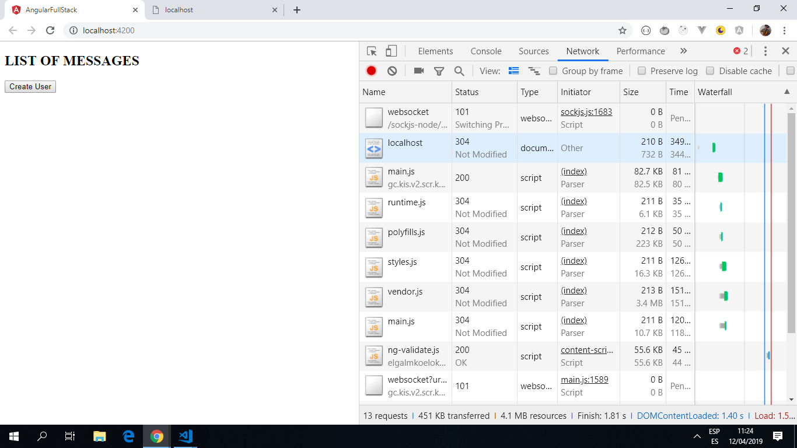

# Angular Full-Stack

This project sets up a Node server application using TypeScript directly within the same folder as an Angular CLI application.

*** Note: to open web links in a new window use: _ctrl+click on link_**

## Table of contents

* [General info](#general-info)
* [Screenshots](#screenshots)
* [Technologies](#technologies)
* [Setup](#setup)
* [Features](#features)
* [Status](#status)
* [Inspiration](#inspiration)
* [Contact](#contact)

## General info

* The server is live within the Angular app directory and is written in Typescript. it was created in a root-level folder called `/server`.
* A json package was created then dependencies (`ts-node ts-node-dev tslint typescript express @types/express`) were added.
* A tsconfig.json file was created so the server could have its own typescript configuration.
* An express server was created.

## Screenshots

.

## Technologies

* [Angular v7.2.12](https://angular.io/) & [Angular CLI v7.3.8](https://cli.angular.io/).

* [RxJS Library v6.4.0](https://angular.io/guide/rx-library) used to handle datastreams and propagation of change using observables.

* [Concurrently](https://www.npmjs.com/package/concurrently) npm dependency used to run multiple commands concurrently.

## Setup

* **To run server only:**  cd to \server then type `npm run serve` to start server & navigate to `http://localhost:4201/`

* **To run front & backend concurrently:** from root level type `ng serve` then navigate to `http://localhost:4200/` & `http://localhost:4200/`. The app will automatically reload if you change any of the source files.

## Code Examples

* server.js file that generates a server from within the app.

```typescript
import express from 'express';
import { routes } from './routes';

const app = express();
const port = 4201;

// allow any method from any host and console.log requests.
app.use((req, res, next) => {
  res.header('Access-Control-Allow-Origin', '*');
  res.header('Access-Control-Allow-Headers', 'Origin, X-Requested-With, Content-Type, Accept');
  res.header('Access-Control-Allow-Methods', 'OPTIONS, GET, POST, PUT, DELETE');
  if ('OPTIONS' === req.method) {
    res.sendStatus(200);
  } else {
    console.log(`${req.ip} ${req.method} ${req.url}`);
    next();
  }
});

// Handle POST requests that come in formatted as JSON
app.use(express.json());

app.use('/', routes);

app.listen(port, '127.0.0.1', () => {
  console.log('Server now listening on port', port);
});

```

## Features

* App runs server from inside angular app, as a 'monorepository'. The advantages of this according to [danluu.com](https://danluu.com/monorepo/) include:

"With a monorepo, projects can be organized and grouped together in whatever way you find to be most logically consistent, and not just because your version control system forces you to organize things in a particular way. Using a single repo also reduces overhead from managing dependencies."

## Status & To-Do List

* Status: * Part working - a post request to `http://localhost:4201/users/` is echoed back, as can be seen using the Chrome Dev Tools Network - Name (users). The single command to start both frontend and backend does not work. I started each one separately.

* To-Do: Fix concurrently command.

## Inspiration

* [Youtube Video: Adding a Node + Typescript Backend to Your Angular App](https://www.youtube.com/watch?v=Ad3fj9V7s6A).

* [Stephen Fluin: Demos with Angular blog post](https://fluin.io/blog/adding-node-typescript-to-angular-app)

* [Medium Article by Stephen Fluin: Adding a Node + Typescript Backend to Your Angular App](https://medium.com/@stephenfluin/adding-a-node-typescript-backend-to-your-angular-app-29b0e9925ff)

## Contact

Created by [ABateman](https://www.andrewbateman.org) - feel free to contact me!
