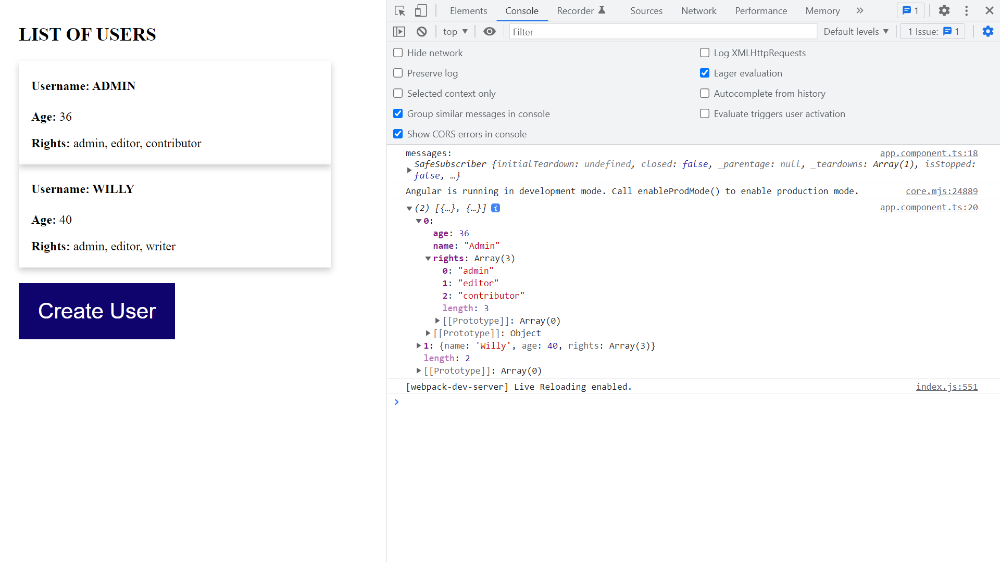

# :zap: Angular Full-Stack

* This project sets up a Node server application using TypeScript directly within the same folder as an Angular CLI application.

*** Note: to open web links in a new window use: _ctrl+click on link_**

## :page_facing_up: Table of contents

* [:zap: Angular Full-Stack](#zap-angular-full-stack)
  * [:page\_facing\_up: Table of contents](#page_facing_up-table-of-contents)
  * [:books: General info](#books-general-info)
  * [:camera: Screenshots](#camera-screenshots)
  * [:signal\_strength: Technologies](#signal_strength-technologies)
  * [:floppy\_disk: Setup](#floppy_disk-setup)
  * [:computer: Code Examples](#computer-code-examples)
  * [:cool: Features](#cool-features)
  * [:clipboard: Status \& To-Do List](#clipboard-status--to-do-list)
  * [:clap: Inspiration](#clap-inspiration)
  * [:file\_folder: License](#file_folder-license)
  * [:envelope: Contact](#envelope-contact)

## :books: General info

* The server is live within the Angular app directory and is written in Typescript, in root-level folder `/server`.
* A JSON package was created, then the dependencies (`ts-node ts-node-dev tslint typescript express @types/express`) were added.
* A `tsconfig.json` file was created so the server could have its own typescript configuration for the express server.
* `http://localhost:4200/users` displays a users list observable using the Angular async pipe

## :camera: Screenshots

.

## :signal_strength: Technologies

* [Angular v15](https://angular.io/)
* [RxJS Library v7](https://angular.io/guide/rx-library) used to handle datastreams and propagation of change using observables.
* [Concurrently v7](https://www.npmjs.com/package/concurrently) npm dependency used to run multiple commands concurrently.

## :floppy_disk: Setup

* `npm i` && `cd server && npm i` to install dependencies for front & backends
* **To run front & backend concurrently:** from root level type `npm run serve` then navigate to `http://localhost:4200/` & `http://localhost:4201/users`. The app will automatically reload if you change any of the source files.

## :computer: Code Examples

* server.js file that generates a server from within the app.

```typescript
import express from 'express';
import { routes } from './routes';

const app = express();
const port = 4201;

// allow any method from any host and console.log requests.
app.use((req, res, next) => {
  res.header('Access-Control-Allow-Origin', '*');
  res.header('Access-Control-Allow-Headers', 'Origin, X-Requested-With, Content-Type, Accept');
  res.header('Access-Control-Allow-Methods', 'OPTIONS, GET, POST, PUT, DELETE');
  if ('OPTIONS' === req.method) {
    res.sendStatus(200);
  } else {
    console.log(`${req.ip} ${req.method} ${req.url}`);
    next();
  }
});

// Handle POST requests that come in formatted as JSON
app.use(express.json());

app.use('/', routes);

app.listen(port, '127.0.0.1', () => {
  console.log('Server now listening on port', port);
});

```

## :cool: Features

* App runs server from inside angular app, as a 'monorepository'. The advantages of this according to [danluu.com](https://danluu.com/monorepo/) include:

"With a monorepo, projects can be organized and grouped together in whatever way you find to be most logically consistent, and not just because your version control system forces you to organize things in a particular way. Using a single repo also reduces overhead from managing dependencies."

## :clipboard: Status & To-Do List

* Status: Working
* To-Do: Nothing

## :clap: Inspiration

* [Youtube Video: Adding a Node + Typescript Backend to Your Angular App](https://www.youtube.com/watch?v=Ad3fj9V7s6A).
* [Stephen Fluin: Demos with Angular blog post](https://fluin.io/blog/adding-node-typescript-to-angular-app)
* [Medium Article by Stephen Fluin: Adding a Node + Typescript Backend to Your Angular App](https://medium.com/@stephenfluin/adding-a-node-typescript-backend-to-your-angular-app-29b0e9925ff)

## :file_folder: License

* This project is licensed under the terms of the MIT license.

## :envelope: Contact

* Repo created by [ABateman](https://github.com/AndrewJBateman), email: gomezbateman@yahoo.com
